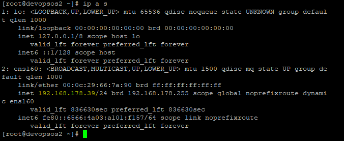
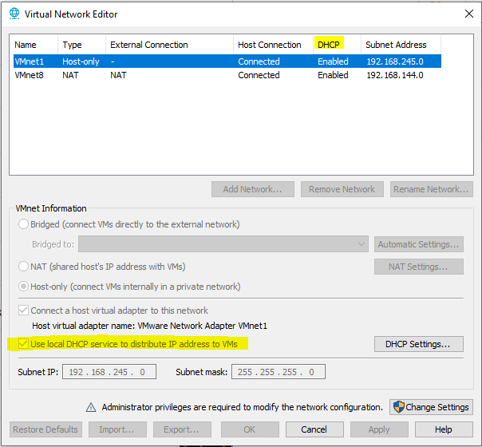

# How to install CentOS 7.9 on a virtual machine

- [ ] Download and install VMware Workstation Player | Pro from [here](https://www.vmware.com/products/workstation-pro.html)
- [ ] Create a new virtual machine in the VMware workstation application
- [ ] Configure additional parameters for RAM, HDD, CPU, ...
- [ ] A light CentOS Linux **ISO** can be downloaded from this [website](https://ftp.riken.jp/Linux/centos/7.9.2009/isos/x86_64/)
- [ ] Imports the downloaded ISO into the virtual machine
- [ ] Set up a network adapter by following the instructions in this [link]( https://linuxhint.com/install_centos8_netboot_iso)
 
   <sub> the first part of the instructions about creating a bootable flash drive can be skipped. </sub>
- [ ] In the Software section, use the address https://mirror.23m.com/centos/7.9.2009/os/x86_64
- [ ] The CentOS prompt will appear once you have created a root user and completed the remaining steps
- [ ] Connect to the installed operating system using the **Putty** application
- [ ] Once you have successfully logged into the OS, run the following command to install a few additional useful tools:
    ```
    yum -y install vim-common vim-enhanced bash-completion epel-release
    ```
- [ ] You are now able to use the vim editor to create and edit the file
- [ ] Use the following command to change the host name:
   
    <sub> 
   
    there is additional information available [here](https://phoenixnap.com/kb/how-to-set-or-change-a-hostname-in-centos-7)
    
    </sub>
    
    ```
    hostnamectl set-hostname "devops"
    ```
## How to configure network adapter settings in one VM
- [ ] Identify the first file in the path below beginning with ifcfg*:
    ```
   ·/etc/sysconfig/network-scripts/
    ```
- [ ] Use the **vim** command to edit the file and set the following parameters:
	- DNS1=8.8.8.8
	- IPADDR=192.168.x.x
	- GATEWAY=x.x.x.x
	- BOOTPROTO=none

    <sub> Changing the network address should only be done on a separate host, and if two VMs are running on the same host, it is not practical to do so. Therefore, BOOTPROTO must be set to DHCP</sub>	
## How to configure network adapter settings in more than one VM

- [ ] Change the network adapter setting to **Bridge** and ensure that the **Replicate** option is enabled
- [ ] To ensure that each virtual machine has an individual IP address, use the '**ip a s**' command

<p align="center">
    
</p>

- [ ] Follow the **Edit -> Virtual Network Editor** from the Workstation Pro in order to ensure that DHCP is enabled for each virtual machine

<p align="center">
    
</p>

- [ ] The **'ping 8.8.8.8'** command can be used if you want to ensure that your setting is working properly

    <sub>The setting is incorrect if you receive **'connect: Network is unreachable'** message</sub>  
    
    <sub> 
    
    There is additional information available on [redhat](https://www.redhat.com/sysadmin/network-interface-linux) and [stack exchange](https://superuser.com/questions/1362821/ping-8-8-8-8-connect-network-is-unreachable-in-centos-7-on-vmware-workstati)    
    
    </sub> 