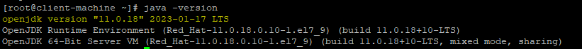

# How to install java 11 on CentOs
- [ ] In order to remove the old installed Java from your VM, follow these steps:
	- [ ] Use **which java** command to find the Java installation path
	- [ ] To remove an old installation of Java, run the following command:
        ```
        sudo rm -r installed_java_path
        ```
	- [ ] It would be better to use one of the commands below:
        ```
        rpm -qa | grep java
        rpm -e package_name
        ```
- [ ] To ensure your virtual machine has the required Java packages, run the following command:
    ```
    yum search jdk
    ```
- [ ] If the required package is unavailable, update the repository to ensure you download the latest version:
    ```
    sudo yum update
    ```
- [ ] Then, install the Java Development Kit with the following command:
    ```
    sudo yum -y install java-11-openjdk
    ```
- [ ] If Java was successfully downloaded and installed, the output details should match the image below:
    <p align="center">
        
    </p>