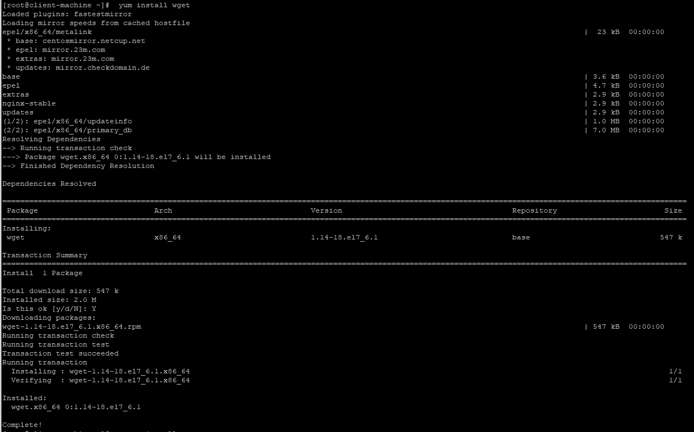

# How to install a particular package on CentOs
- [ ] To ensure the virtual machine has the required packages, run the following command:
    ```
    sudo yum search package_name
    ```
- [ ] If the required package is unavailable, update the repository to ensure you download the latest version:
    ```
    sudo yum update
    ```
- [ ] Then, install the package with the following command:
    ```
    sudo yum -y install package_name
    ```
    <sub>                                                  

    - [ ] The **wget** package can be installed using the following command as a useful CentOs package:
        ```
        sudo yum search wget
        sudo yum update
        sudo yum -y install wget
        ```
    </sub>    
- [ ] If the package was successfully downloaded and installed, the output details should match the image below:
    <p align="center">
        
    </p>