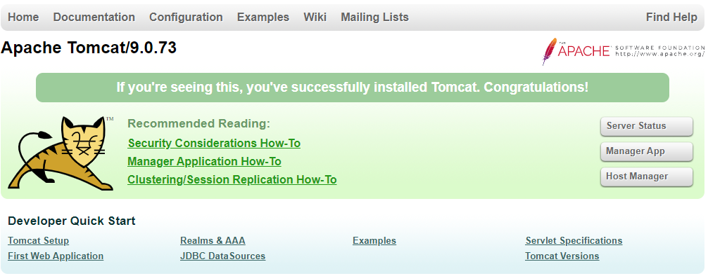

# How to install tomcat 9 on CentOs

- [ ] Run the following command to ensure Java is installed on the VM:
    ```
    java -version
    ```
    <sub>The Java installation instructions can be found [here](java.md)</sub>
- [ ] To download the tar file, run the following command:
    ```
    wget -O /opt 'https://dlcdn.apache.org/tomcat/tomcat-9/v9.0.73/bin/apache-tomcat-9.0.73.tar.gz'
    ```    
    <sub>The **/opt** folder is a good place to install Tomcat</sub>
- [ ] Run the following command to extract the tar file:
    ```
    tar -zxvf apache-tomcat-9.0.73.tar.gz
    ```
- [ ] To execute Tomcat, locate the /bin folder and run the following command::
    ```
    ./bin/startup.sh 
    ```
- [ ] To test the Tomcat 9 install and verify it is running on the vm, open and point the browser to localhost:8080 (or whatever custom port):
    <p align="center">
        
    </p>  
         