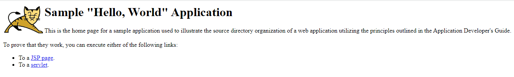

# How to install tomcat 9 on CentOs

- [ ] Run the following command to ensure Java is installed on the VM:
    ```
    java -version
    ```
    <sub>The Java installation instructions can be found [here](java.md)</sub>
- [ ] To download the tar file, run the following command:
    ```
    wget -P /opt 'https://dlcdn.apache.org/tomcat/tomcat-9/v9.0.73/bin/apache-tomcat-9.0.73.tar.gz'
    ```    
    <sub>The package installation instructions can be found [here](package.md)</sub>
    
    <sub>The **/opt** folder is a suitable place to install Tomcat</sub>
- [ ] Run the following command to extract the tar file:
    ```
    tar -zxvf apache-tomcat-9.0.73.tar.gz
    ```
- [ ] To execute Tomcat, locate the /bin folder and run the following command::
    ```
    ./bin/startup.sh 
    ```
- [ ] To test the Tomcat 9 install and verify it is running on the vm, open and point the browser to VM_IP:8080 (or whatever custom port):
    <p align="center">
        
    </p>  
## How to deploy a WAR file to Tomcat
- [ ] The simplest way to deploy a WAR file to Tomcat is to copy the file to Tomcat’s webapps directory
- [ ] [Here](https://tomcat.apache.org/tomcat-7.0-doc/appdev/sample/sample.war) is a sample Tomcat war file application that can be downloaded 
    ```
    wget https://tomcat.apache.org/tomcat-7.0-doc/appdev/sample/sample.war
    ```
    
- [ ] move the sample.war file to the **CATALINA_HOME/webapps** directory of Tomcat
    ```
    mv sample.war /opt/tomcat_dir/webapp  
    ```
- [ ] Run the following commands to restart the Tomcat:
    ```
    ./bin/shutdown.sh
    ./bin/startup.sh
    ```
- [ ] To test the sample application and verify it is running, open and point the browser to http://virtual_machine_ip:8080/sample/ (or whatever custom port):
    <p align="center">
        
    </p>         